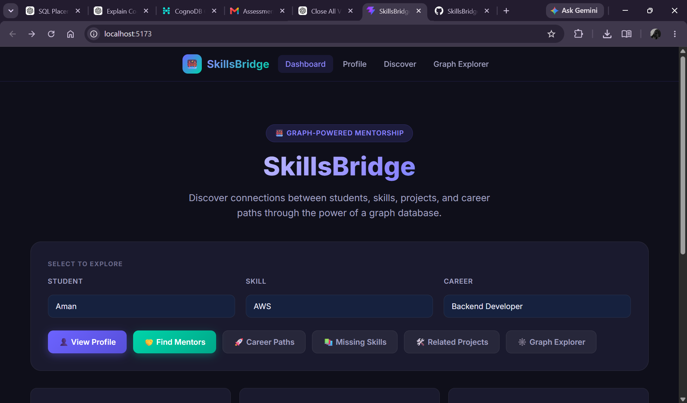
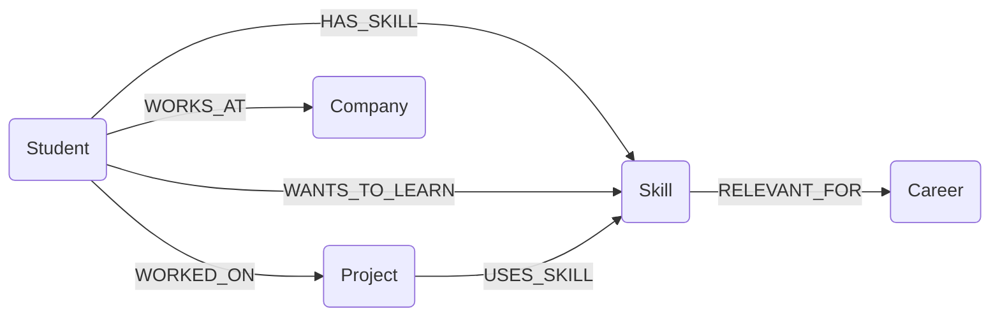
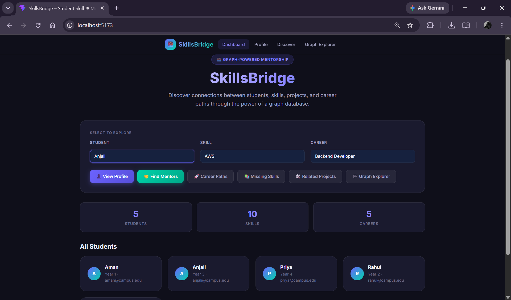
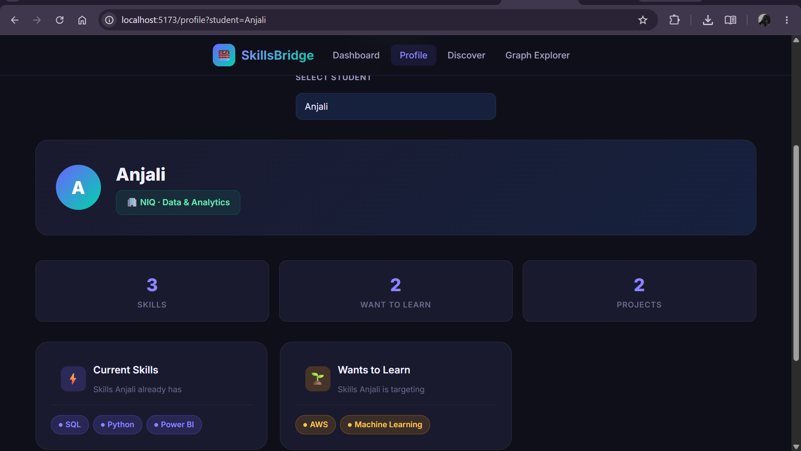
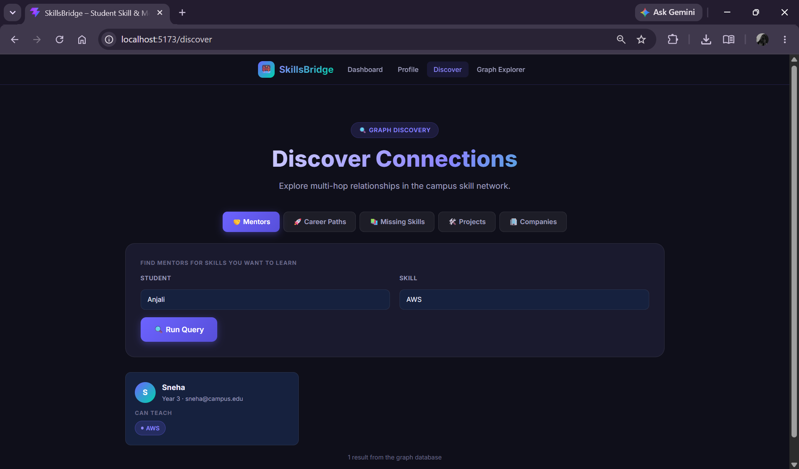
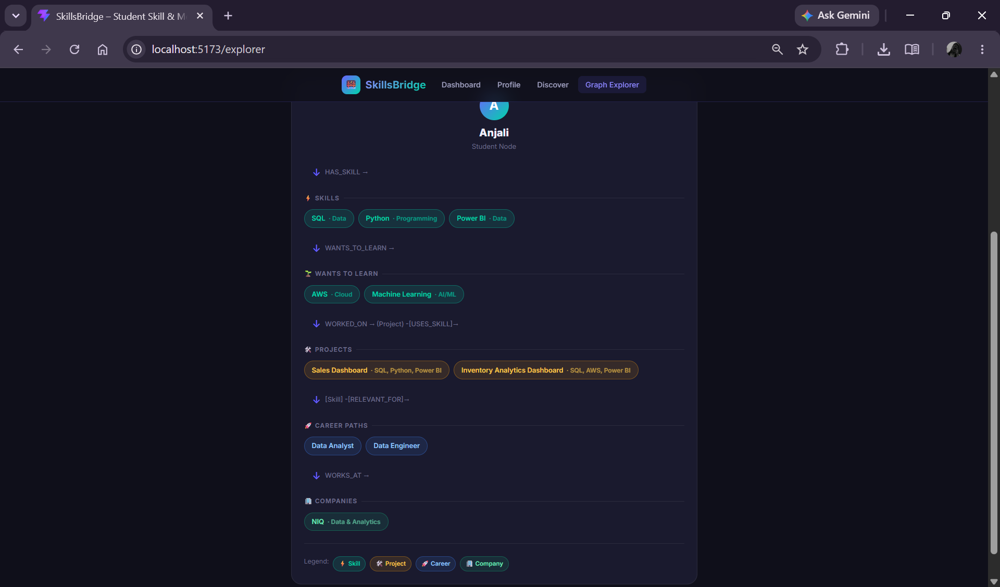

# SkillsBridge

> A Student Mentorship & Skill Network powered by a graph database.

[](screenshots/demo.mp4)

## Overview

SkillsBridge helps students discover connections between **students**, **skills**, **projects**, **career roles**, and **companies**. A user selects a student and a skill/career, and the application shows relevant people, projects, skills, and career paths — all connected through a graph.

The application is built as a take-home assignment to demonstrate:
- Thoughtful **graph data modelling**
- Expressive **Cypher queries** including multi-hop graph traversal
- Clean **engineering architecture** (service layer, route separation, environment-based config)
- A polished, responsive **React UI**

---

## Why a Graph Database?

In SkillsBridge, the most important questions are **relationship questions**:

| Question | Why graph is better |
|---|---|
| Who can mentor me in Machine Learning? | Requires traversing `WANTS_TO_LEARN → Skill ← HAS_SKILL ← Mentor` in 2 hops |
| What projects use a skill I know? | Multi-hop: `Skill ← USES_SKILL ← Project ← WORKED_ON ← Student` |
| What careers suit my current skills? | `Student → HAS_SKILL → Skill → RELEVANT_FOR → Career` |
| What skills am I missing for a career? | Set-difference query: career skills minus student skills |

In a **relational schema**, each of these would require multiple JOINs across normalised tables and complex SQL. In a **graph schema**, these are natural Cypher path expressions — shorter, more readable, and more efficient for relationship-heavy workloads.

The graph model also allows **multi-hop traversal without schema changes**: adding a new relationship type (e.g., `PEER_OF`) costs nothing structurally.

---

## Data Model

### Nodes

| Label | Key Properties |
|---|---|
| `Student` | `name`, `email`, `year` |
| `Skill` | `name`, `category` |
| `Project` | `name`, `description` |
| `Career` | `name`, `description` |
| `Company` | `name`, `industry` |

### Relationships

| Relationship | From → To |
|---|---|
| `HAS_SKILL` | `Student → Skill` |
| `WANTS_TO_LEARN` | `Student → Skill` |
| `WORKED_ON` | `Student → Project` |
| `USES_SKILL` | `Project → Skill` |
| `RELEVANT_FOR` | `Skill → Career` |
| `WORKS_AT` | `Student → Company` |

### Mermaid Diagram



---

## Architecture

```
React (Vite) → Express → Neo4j JS Driver → CognoDB
```

```
client/            React + Vite frontend
  src/
    components/    Reusable UI: Navbar, Loader, ErrorState, etc.
    pages/         Dashboard, StudentProfile, DiscoveryResults, GraphExplorer
    services/      api.js – Axios wrapper

server/            Express backend
  src/
    config/        db.js – Neo4j driver setup
    routes/        REST route handlers
    services/      Cypher query logic
    middleware/    Central error handler
    server.js

database/
  seed.js          Idempotent seed script (uses MERGE)
  queries.cypher   Reference Cypher queries
```

---

## Main Cypher Queries

### 1. Multi-hop traversal – Students & Projects by Skill

```cypher
-- Hop 1: Student → HAS_SKILL → Skill
-- Hop 2: Student → WORKED_ON → Project → USES_SKILL → Skill (same)
MATCH (s:Student)-[:HAS_SKILL]->(sk:Skill {name: $skill})
MATCH (s)-[:WORKED_ON]->(p:Project)-[:USES_SKILL]->(sk)
RETURN s.name AS student, p.name AS project, p.description AS description
```

This query is **awkward with a relational schema** because it requires: joining `students → student_skills → skills`, then joining `students → student_projects → projects → project_skills → skills`, then cross-joining on the same skill — all in a single SQL query.

### 2. Recommended Mentors (multi-hop)

```cypher
-- Traversal: learner -[WANTS_TO_LEARN]-> skill <-[HAS_SKILL]- mentor
MATCH (s:Student {name: $student})-[:WANTS_TO_LEARN]->(sk:Skill)<-[:HAS_SKILL]-(mentor:Student)
WHERE mentor.name <> $student
RETURN DISTINCT mentor.name AS mentor, collect(sk.name) AS sharedSkills
```

### 3. Missing Skills for a Career

```cypher
MATCH (c:Career {name: $career})<-[:RELEVANT_FOR]-(sk:Skill)
WHERE NOT EXISTS {
  MATCH (s:Student {name: $student})-[:HAS_SKILL]->(sk)
}
RETURN sk.name AS missingSkill, sk.category AS category
```

> All queries use `$param` syntax. **No string concatenation** is used anywhere in the codebase.

---

## Setup

### Prerequisites

- Node.js 18+
- A **CognoDB** instance (Neo4j-compatible graph database)
- npm

### 1. Clone the repository

```bash
git clone <repo-url>
cd skillsbridge
```

### 2. Create a CognoDB instance

1. Go to [https://www.cognodb.com](https://www.cognodb.com) (or your provider)
2. Create a new graph database instance
3. Note down the **Bolt URI**, **username**, and **password**

### 3. Create `.env`

```bash
cp .env.example .env
```

Edit `.env`:

```
COGNODB_URI=bolt+ssc://your-instance.cognodb.com:7687
COGNODB_USERNAME=neo4j
COGNODB_PASSWORD=your-password
PORT=5000
```

### 4. Install backend dependencies

```bash
cd server
npm install
```

### 5. Install database seed dependencies

```bash
cd ../database
npm install
```

### 6. Run the seed script

```bash
# from skillsbridge/database/
node seed.js
```

Expected output:
```
🌱  Seeding CognoDB …
✅  Seed complete. All nodes and relationships created/merged.
```

### 7. Start the backend

```bash
# from skillsbridge/server/
npm run dev
```

Expected output:
```
✅  Connected to CognoDB at bolt+ssc://...
🚀  SkillsBridge server running on http://localhost:5000
```

### 8. Install and start the frontend

```bash
# from skillsbridge/client/
npm install
npm run dev
```

Open [http://localhost:5173](http://localhost:5173)

---

## Environment Variables

| Variable | Description |
|---|---|
| `COGNODB_URI` | Bolt URI for CognoDB (e.g., `bolt+ssc://...`) |
| `COGNODB_USERNAME` | Database username |
| `COGNODB_PASSWORD` | Database password |
| `PORT` | Backend server port (default: 5000) |

---

## Running Locally

```bash
# Terminal 1 – Backend
cd skillsbridge/server
npm install
npm run dev

# Terminal 2 – Frontend
cd skillsbridge/client
npm install
npm run dev

# Terminal 3 – Seed (once)
cd skillsbridge/database
npm install
node seed.js
```

---

## API Endpoints

| Method | Endpoint | Description |
|---|---|---|
| GET | `/api/students` | All students |
| GET | `/api/skills` | All skills |
| GET | `/api/careers` | All careers |
| GET | `/api/projects` | All projects |
| GET | `/api/students/:name/skills` | Student profile |
| GET | `/api/discover/mentors?student=X&skill=Y` | Recommended mentors |
| GET | `/api/discover/projects?skill=Y` | Projects by skill |
| GET | `/api/discover/careers?student=X` | Career paths for student |
| GET | `/api/discover/missing-skills?student=X&career=Y` | Missing skills |
| GET | `/api/discover/companies?skill=Y` | Companies by skill |
| GET | `/api/discover/graph?student=X` | Full student graph |

---

## Screenshots

> Add screenshots to the `screenshots/` folder and update paths below.

| Dashboard | Student Profile |
|---|---|
|  |  |

| Discovery | Graph Explorer |
|---|---|
|  |  |

---

## Demo

> 🔗 Hosted application URL: https://skills-bridge-fawn.vercel.app/

## 🎥 Demo
[▶️ Watch SkillsBridge Demo](screenshots/demo.mp4)


